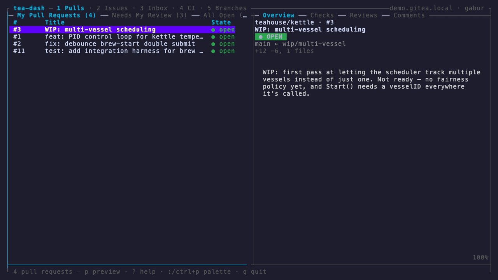

# tea-dash

[](https://github.com/gbarany/tea-dash/actions/workflows/ci.yml)
[](https://scorecard.dev/viewer/?uri=github.com/gbarany/tea-dash)

A terminal dashboard for [Gitea](https://about.gitea.com/) (and Forgejo /
Codeberg), in the spirit of [`gh-dash`](https://github.com/dlvhdr/gh-dash) — but
for Gitea instead of GitHub.

tea-dash is a keyboard-driven TUI for triaging pull requests, issues,
notifications, and local branches across one or more Gitea instances, without
leaving the terminal.



<sub>Real recording of `tea-dash --mock` ([MP4](https://github.com/gbarany/tea-dash/releases/download/v0.3.0/demo.mp4) ·
regenerate with [`docs/vhs/demo.tape`](docs/vhs/demo.tape)). Mouse works too —
click rows/tabs, scroll either panel, right-click a row for its action
palette — it just can't be scripted into this recording.</sub>

> **Status: early — v1.** A full-screen, framed dashboard over five views —
> pull requests, issues, notifications, Actions runs, and local branches
> (fetched via the Gitea API (Go SDK + REST) and local `git`) — with
> lazygit-style keys (`1`–`5` view jumps, `enter` to focus the preview, `?`
> full help, `:` command palette), first-class mouse support (click, wheel,
> double- and right-click), configurable sections, live keyword search,
> progressive loading, state icons and colors, and actions for PRs, issues,
> notifications, CI runs, and branches. Try it with zero setup:
> `tea-dash --mock`. See [`docs/architecture.md`](docs/architecture.md) for
> the design.

## Why

There is a rich TUI dashboard for GitHub (`gh-dash`) but nothing equivalent for
Gitea/Forgejo. tea-dash fills that gap by building on Gitea's own official Go
SDK, reusing the `tea` CLI's stored login for auth.

## How it works

tea-dash talks to Gitea directly via the official Go SDK
(`code.gitea.io/sdk/gitea`). It reuses your existing `tea` login
(`~/Library/Application Support/tea/config.yml` on macOS /
`~/.config/tea/config.yml` on Linux) for the instance URL and token, so you get
auth for free without tea-dash handling credentials itself — but `tea` is **not**
run at runtime. This means tea-dash:

- reuses your existing `tea` logins, so **auth and multi-instance support come
  for free**;
- keeps credentials out of its own hands — it only reads what `tea` already
  stored;
- works against any Gitea/Forgejo server the SDK supports.

See [`docs/architecture.md`](docs/architecture.md) for the details.

## Requirements

- [Go](https://go.dev) 1.26+ (to build; matches go.mod and the Gitea SDK's own `go 1.26`)
- A `tea` login for the instance URL and token. You only need
  [`tea`](https://gitea.com/gitea/tea) **once** to create a login
  (`tea login add`) — it is not a runtime dependency, and does not need to be on
  your `PATH` when tea-dash runs.

## Install

Homebrew:

```sh
brew install --cask gbarany/tap/tea-dash
```

Or with Go:

```sh
go install github.com/gbarany/tea-dash@latest
```

Or build from source:

```sh
git clone https://github.com/gbarany/tea-dash
cd tea-dash
make build      # -> ./bin/tea-dash
```

## Usage

```sh
tea-dash            # start the dashboard
tea-dash --mock     # try it on built-in demo data (no Gitea needed)
tea-dash --config ./team.tea-dash.yml
tea-dash --debug    # append debug output to ./debug.log
tea-dash --version  # print version info
tea-dash --help
```

### Try it without a Gitea instance

```sh
tea-dash --mock
```

Runs the full dashboard against an in-process fake Gitea preloaded with a
fictional `teahouse` org — every view is populated, and actions (merge,
comment, close, mark read, …) really mutate the demo data. No network, no
login. A throwaway local git repo is seeded for the Branches view (needs
`git` on PATH; without it, that view shows an error instead of demo
branches).

Notes: `--mock` composes with an explicit `--config`, but the fake's search
ignores the `mentioned`, `since`, and `sort` filters. In the Branches view,
push/force-push/fast-forward fail with a clear error (the demo repo has no
real remote) — checkout works. A supplied `--config` REPLACES the demo's
section definitions per view, not merges with them: a config that only sets
`theme` (no `prSections`/`issuesSections`/`actionsSections`/etc.) falls back
to tea-dash's normal single-section defaults, which empties views the demo
otherwise populates richly (e.g. the CI view shows "No configured Actions
sections." instead of the demo's kettle/steep workflow runs) — add explicit
sections to your config if you want the full demo data alongside custom
theme/keybinding settings.

### Keys

tea-dash's keymap is lazygit-style: numbered view jumps, and `enter`/`tab`
drill into (focus) the preview panel rather than opening a browser.

| Group | Key | Action |
| --- | --- | --- |
| Views | `1`–`5` | jump to Pulls / Issues / Inbox / CI / Branches |
| Views | `s` | cycle views (kept for continuity) |
| Sections | `h`/`l`, `←`/`→` | previous / next section tab |
| List | `j`/`k`, `↑`/`↓` | move selection |
| List | `g`/`G` | first / last row |
| List | `ctrl+d`/`ctrl+u` | half-page down / up in the list |
| List | mouse click, double-click, mouse wheel | select row, focus preview, move selection |
| List | right-click | open the command palette scoped to that row's actions |
| Preview | `enter` or `tab` | focus preview (drill in) |
| Preview (focused) | `j/k` scroll · `d/u` half-page · `g/G` top/bottom · `[`/`]` preview tabs · `esc`/`tab`/`enter` back |
| Preview | `p` | toggle pane · `e` expand body |
| Search | `/` | focus search · `enter` apply · `esc` revert |
| Global | `esc` | universal dismiss: overlay (help/palette) → prompt → search → preview focus |
| Global | `?` | show / hide full help |
| Global | `:` / `ctrl+p` | command palette — fuzzy-filter actions, view/section jumps, and custom commands |
| Global | `o` | open in browser |
| Global | `r` / `R`† | refresh section / refresh all |
| Global | `y` / `Y` | copy row number / URL |
| Global | `t` | toggle current-repo smart filtering (when launched from a matching git checkout) |
| Global | `q` / `ctrl+c` | quit |
| PRs | `c` comment · `a`/`A` assign/unassign · `L`/`U` labels · `m` merge · `u` update branch · `W` ready · `w` checks · `x`/`X` close/reopen · `v` review · `@`/`#` request/remove reviewers · `d`/`ctrl+t` diff · `C`/`space` checkout |
| Issues | `c` comment · `a`/`A` assign/unassign · `L`/`U` labels · `M` milestone · `b`/`B` subscribe/unsubscribe · `x`/`X` close/reopen · `C`/`space` checkout |
| Inbox | `m` read · `u` unread · `M` all read · `b` pin/unpin · `B` unpin |
| CI | `R` rerun · `!` cancel · `L` logs |
| Branches | `C`/`space`/`enter`\* checkout · `P` push · `f` fast-forward · `F` force-push · `d`/`backspace` delete |

\* In the Branches view `enter` keeps meaning checkout (its rows have no
preview drill-in target of their own); the preview-focus binding falls back
to `tab` there. This is the only view-specific `enter` exception.

† In the CI view specifically, `R` is scoped to rerun instead (see the CI
row) — refresh a CI section with `r`; there is no refresh-all default key
in that view (a custom keybinding can still reach `refreshAll` there).

The merge picker includes each merge strategy plus explicit `+ delete branch`,
`with message`, `+ force merge`, `when checks pass`, and combined variants.

#### Changed in vNEXT

| Old | New | Why |
| --- | --- | --- |
| `enter` opened browser | `enter` focuses preview; use `o` | lazygit drill-in convention |
| `ctrl+u`/`ctrl+d` scrolled preview | scroll the **list**; preview scrolls when focused (`j/k`/`d`/`u`/`g`/`G`), or via mouse wheel | lazygit/vim list paging |
| `ctrl+r` refresh all | dropped; use `R` — except in the CI view, where `R` reruns instead and refresh-all has no default key at all | duplicate |
| `[`/`]` preview tabs from list | only while preview is focused | `[`/`]` are panel-tab keys in lazygit |
| — | `1`–`5` view jump, `tab` focus toggle, `esc` dismiss | new |

## Configuration

Optional. tea-dash reads the first config it finds in this order:

1. `--config <path>` / `-c <path>`
2. `TEA_DASH_CONFIG`
3. `.tea-dash.yml` or `.tea-dash.yaml` in the current git repository root
4. `$XDG_CONFIG_HOME/tea-dash/config.yml`

Use config to pick a tea login, choose the startup view, and define your own
sections. A fuller copyable example lives at
[`examples/tea-dash.yml`](examples/tea-dash.yml).

```yaml
# yaml-language-server: $schema=https://raw.githubusercontent.com/gbarany/tea-dash/main/schema.json

include:
  - ./shared-tea-dash.yml # loaded first; this file wins on conflicts

instance:
  login: ""          # tea login profile to use (empty = your default tea login)
  # url:   ""        # override the instance URL (else taken from the tea login)
  # Token source (first non-empty wins): token > tokenCommand > tokenEnv > TEA_DASH_TOKEN > tea login.
  # tea-dash reads the token from tea's config file. If tea stored yours in the OS
  # keychain (so the config's token is empty), give tea-dash one of these instead:
  # token:        ""                                      # a literal token (not recommended in plaintext)
  # tokenCommand: "<command that prints the token>"        # e.g. pass, gopass, 1Password CLI, etc.
  # tokenEnv:     TEA_DASH_TOKEN                           # name of an env var holding the token

smartFilteringAtLaunch: true # when launched inside a matching git checkout, blank PR/issue sections scope to that repo
confirmQuit: false           # set true to ask before quitting with q/ctrl+c

defaults:
  view: prs              # startup view: "prs", "issues", "notifications", "actions", or "branches"
  refetchIntervalMinutes: 0 # auto-refresh current view every N minutes (0/omitted -> manual only)
  preview:
    open: true           # initial preview pane state (omit to default true)
    width: 84            # preview pane width in columns (0 or omit -> automatic 50/50 split)
  prsLimit: 50           # PR page size; more rows load when you reach the bottom (0 -> 50)
  issuesLimit: 50        # issue page size; more rows load when you reach the bottom (0 -> 50)
  notificationsLimit: 50 # rows fetched per notifications section (0 -> 50)
  includeReadNotifications: true # include read notifications in default notification sections
  actionsLimit: 50       # rows fetched per Actions section (0 -> 50)
  branchesLimit: 0       # local branches shown (0 -> all)

repos:
  - acme/widgets         # PR/issue sections without repo: fan out across these repos
  - acme/api             # omit repos to use the instance-wide cross-repo search endpoint

localRepos:
  - name: tea-dash
    path: ~/src/tea-dash

pager:
  diff: diffnav     # command that receives PR diff bytes on stdin (falls back to $PAGER, then less -R)

repoPaths:
  "example/*": "~/src/{{.Repo}}"  # used by C checkout; exact repo names and wildcards both work

git:
  remote: origin
  prBranchTemplate: "pr-{{.PrIndex}}"
  issueBranchTemplate: "issue-{{.IssueIndex}}"

theme:
  icons: unicode # "unicode" (default) | "nerd" (needs a Nerd Font) | "ascii"
  colors:
    text:
      primary: "#CBE3E7"   # title, active tab, spinner, table header, action buttons
      secondary: "#A1EFD3" # selected-row text
      faint: "#8A889D"     # dim text, inactive tabs, help
      warning: "#F48FB1"   # notices and errors
    background:
      selected: "#3E3859"  # selected-row background
    border:
      primary: "#585273"   # parsed for gh-dash theme compatibility; deeper border theming is future work
    state: # PR/issue/CI state colors (list state cells, preview headers, CI check lines)
      open: "#2da44e"      # also draft/merged/closed/success/failure/running/neutral
      failure: "#cf222e"   # shown here as an example override; omit any key to keep its gh-style default

# Each section becomes a tab you page through with h/l. A section-level repo:
# overrides global repos: for that tab. Omit prSections to get two
# "@me"-authored PR defaults: open and closed pull requests. Omit issuesSections
# to get one open "@me"-authored issues section.
prSections:
  - title: Open PRs
    columns:
      - number
      - name: title
        title: Summary
        width: 52
      - repo
      - state
      - updated
    filter:
      state: open          # open | closed | all (default open)
      createdBy: "@me"     # me-scoped author fields accept "@me" only
  - title: Closed PRs
    filter:
      state: closed        # closed includes merged PRs; merged rows show "merged"
      createdBy: "@me"
  - title: Review Requested
    filter:
      reviewRequested: "@me"
    limit: 25              # per-section page size; overrides defaults.prsLimit
  - title: Alice in Widgets
    repo: acme/widgets     # repo-scoped sections can use plain login filters
    filter:
      state: open
      createdBy: alice

issuesSections:
  - title: My Issues
    filter:
      state: open
      assignedBy: "@me"
      labels: [bug, urgent]  # AND-ed
      milestone: v2

notificationsSections:
  - title: Inbox
    limit: 50

actionsSections:
  - title: Widget CI
    repo: acme/widgets     # Actions sections are repo-scoped (repo: or global repos:)
    limit: 25
    filter:
      branch: main         # optional: only runs for this branch

branchSections:
  - title: Local Branches

keybindings:
  universal:
    - key: tab
      builtin: nextSection
    - key: ctrl+l
      builtin: redraw
    - key: g
      builtin: firstLine
    - key: G
      builtin: lastLine
    - key: H
      builtin: help
  prs:
    - key: I
      builtin: viewIssues
    - key: O
      builtin: checkout
    - key: a
      builtin: assign
    - key: A
      builtin: unassign
    - key: L
      builtin: addLabel
    - key: U
      builtin: removeLabel
    - key: u
      builtin: update
    - key: W
      builtin: ready
    - key: w
      builtin: watchChecks
    - key: "@"
      builtin: requestReviewers
    - key: "#"
      builtin: removeReviewers
    - key: "["
      builtin: prevSidebarTab
    - key: "]"
      builtin: nextSidebarTab
    - key: g
      name: lazygit
      command: cd {{.RepoPath}} && lazygit
  issues:
    - key: P
      builtin: viewPrs
    - key: C
      builtin: checkout
    - key: a
      builtin: assign
    - key: A
      builtin: unassign
    - key: L
      builtin: addLabel
    - key: U
      builtin: removeLabel
    - key: M
      builtin: setMilestone
    - key: b
      builtin: subscribe
    - key: B
      builtin: unsubscribe
    - key: i
      command: echo issue {{.IssueNumber}} in {{.RepoName}}
  notifications:
    - key: b
      builtin: togglePin      # gh-dash-compatible alias: toggleBookmark
    - key: B
      builtin: unpin
    - key: D
      builtin: markAllRead
  actions:
    - key: L
      builtin: viewLogs
    - key: a
      command: echo run {{.RunID}} in {{.RepoName}}
  branches:
    - key: B
      command: git -C {{.RepoPath}} status
    - key: P
      builtin: push
    - key: f
      builtin: fastForward
    - key: F
      builtin: forcePush
    - key: d
      builtin: delete
```

tea-dash publishes a JSON Schema at
[`schema.json`](schema.json). Add the `yaml-language-server` comment above to
your config file to get editor validation and autocomplete in YAML-aware editors.

`theme.icons` picks the glyph set used for state indicators (list state cells,
preview headers, CI check lines, notification unread dots, branch ahead/behind
markers): `unicode` (default, plain symbols that render in any modern
monospace font), `ascii` (7-bit fallback for fonts/terminals with no Unicode
glyph coverage), or `nerd` (git/CI icons from [Nerd
Fonts](https://www.nerdfonts.com) — **requires a Nerd Font installed and
selected as your terminal's font**; without one, `nerd` glyphs render as blank
or "tofu" boxes). `theme.colors.state` overrides the color each state renders
in, independently of the icon set.

Use `include` to share config across files. Include paths are resolved relative
to the file declaring them unless they are absolute or start with `~`. Includes
are loaded first; later includes override earlier includes; the current file
overrides all included values. Nested maps merge recursively, while arrays and
scalars replace the previous value.

`filter` fields: `state`, `labels` (AND-ed), `milestone`, `createdBy`,
`assignedBy`, `mentioned`, `reviewRequested` (PRs only), `since` (RFC3339),
`sort`. PR and issue sections fetch one page at a time; reaching the loaded
bottom automatically requests the next page until the server total is loaded.
PR and issue sections can also set `columns` to choose table order and width.
Supported column names are `number`, `title`, `repo`, `author`, `state`, and
`updated`; each entry may be a plain string or an object with `name`, optional
`title`, and optional non-negative `width`.
When `repos:` is configured, sections without their own `repo:` use the
repo-scoped endpoint for each listed repo and merge the results by updated time;
sections with `repo:` query only that repo. With neither `repos:` nor `repo:`,
tea-dash uses the instance-wide cross-repo search endpoint. `reviewRequested`
is the one exception: Gitea exposes it only on instance-wide PR search, so those
sections ignore `repos:` and stay cross-repo. The page size follows section
`limit` -> per-view default -> 50.

If `smartFilteringAtLaunch` is enabled (the default) and you start `tea-dash`
from a local git checkout whose configured remote host matches the selected
Gitea/Forgejo instance, PR and issue sections without an explicit `repo:` are
scoped to that current repository. Press `t` to toggle between current-repo and
all-repositories mode. Sections with explicit `repo:` always keep their
configured repository.

`keybindings` follows gh-dash's shape: each entry has a `key`, optional `name`,
and exactly one of `builtin` or `command`. Built-ins remap implemented tea-dash
actions; commands run through your shell with row template fields such as
`RepoName`, `RepoPath`, `PrIndex`/`PrNumber`, `IssueIndex`/`IssueNumber`,
`RunID`, `Title`, `Author`, `Sha`, `HeadRefName`, `BaseRefName`,
`InstanceURL`, and `Url`/`URL`. `HeadRefName` and `BaseRefName` are populated
for PR rows once their preview detail has loaded.
The universal `redraw` builtin asks Bubble Tea to clear and repaint the screen,
which is useful if a terminal leaves visual artifacts.
The universal `up` and `down` builtins move the selected row and can be rebound
independently of the default `j`/`k` and arrow-key navigation.
The universal `firstLine` and `lastLine` builtins jump to the first and last
currently loaded row, matching gh-dash's `g`/`G` navigation behavior.
PR-scoped `prevSidebarTab` and `nextSidebarTab` switch the preview pane through
its Overview, Checks, Reviews, and Comments tabs, matching gh-dash's `[`/`]`
preview navigation.
Scoped `viewIssues` and `viewPrs` built-ins jump directly between the PRs and
Issues views, while the universal `switchView` cycles through every top-level
view.

> **Note:** the me-scoped author fields (`createdBy`, `assignedBy`, `mentioned`,
> `reviewRequested`) support the sentinel `"@me"` on cross-repo sections.
> Plain login filters such as `createdBy: alice` require either global `repos:`
> or section-level `repo: owner/name`, because Gitea's cross-repo search
> endpoint has no per-login author filter.

With or without a config file, tea-dash shows the pull requests and issues you
authored, plus read and unread notifications, across every repo you can access
on your Gitea instance. The default PR view has separate open and closed-history
tabs; sections and filters let you tailor what each tab shows. Notification
sections currently support title/limit configuration and include read
notifications by default; set `defaults.includeReadNotifications: false` for
unread/pinned-only threads. The branches view shells out to local `git` for
configured `localRepos` (falling back to the current working directory when
none are configured) and supports checkout, push, force-push, fast-forward,
and delete.

## Security

Every PR and a weekly schedule run CodeQL, govulncheck, gosec, and OpenSSF
Scorecard (see the badge above for the public report). Release archives carry
GitHub build provenance attestations. Vulnerability reports go through
[GitHub Private Vulnerability Reporting](SECURITY.md) — see
[`SECURITY.md`](SECURITY.md) for the policy and how to verify a release.

## Development

```sh
make check   # gofmt-check + go vet + tests (race)
make run     # go run .
make build   # build ./bin/tea-dash
make lint    # golangci-lint (optional; requires golangci-lint v2)
make help    # list all targets
```

Project layout:

```
main.go                 entrypoint + flag handling (incl. --mock); loads config, starts the TUI
internal/ui/            Bubble Tea root model, sections, preview, overlays, keymap, styles
internal/ui/layout/     framed-shell rectangles + mouse-click zones
internal/ui/icons/      unicode/nerd/ascii state glyph sets
internal/gitea/         Gitea Go SDK client wrapper + PR/issue/notification/Actions APIs
internal/git/           local git branch status + branch actions
internal/actionrunner/  dispatches UI action intents (API mutations, local git, custom commands)
internal/markdown/      glamour-based markdown rendering for preview bodies
internal/mockgitea/     in-memory fake Gitea behind --mock and the e2e tests
internal/auth/          resolves instance URL + token from the tea config
internal/data/          TUI-agnostic domain models
internal/config/        config discovery + YAML loading
internal/shell/         runs custom keybinding commands
internal/build/         version metadata (set via -ldflags)
```

## Tech stack

Go with the **Bubble Tea v2** Charm stack — `charm.land/bubbletea/v2` +
`charm.land/lipgloss/v2` + `charm.land/bubbles/v2` + `charm.land/glamour/v2`
(Markdown preview bodies) — the TUI stack
[`gh-dash`](https://github.com/dlvhdr/gh-dash) and Gitea's own `tea` CLI are
built on. Planned, to stay aligned with gh-dash: `cobra`+`fang` (CLI) and
`koanf`+`validator` (config).

## License

[MIT](LICENSE)
